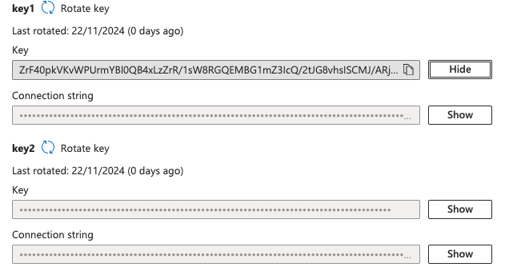

# GCP - VPC & Networking


Learn & practice AWS Hacking:[**HackTricks Training AWS Red Team Expert (ARTE)**](https://training.hacktricks.xyz/courses/arte)\
Learn & practice GCP Hacking: [**HackTricks Training GCP Red Team Expert (GRTE)**](https://training.hacktricks.xyz/courses/grte)

Support HackTricks

* Check the [**subscription plans**](https://github.com/sponsors/carlospolop)!
* **Join the** 💬 [**Discord group**](https://discord.gg/hRep4RUj7f) or the [**telegram group**](https://t.me/peass) or **follow** us on **Twitter** 🐦 [**@hacktricks\_live**](https://twitter.com/hacktricks\_live)**.**
* **Share hacking tricks by submitting PRs to the** [**HackTricks**](https://github.com/carlospolop/hacktricks) and [**HackTricks Cloud**](https://github.com/carlospolop/hacktricks-cloud) github repos.



## **GCP Compute Networking in a Nutshell**

**VPCs**には、VPCへの受信トラフィックを許可する**Firewall**ルールが含まれています。VPCには、**仮想マシン**が**接続**される**サブネットワーク**も含まれています。\
AWSと比較すると、**Firewall**は**AWS**の**Security Groups and NACLs**に最も近いものですが、この場合、これらは各インスタンスではなく**VPCに定義**されています。

## **VPC, Subnetworks & Firewalls in GCP**

Compute Instancesは**VPCs**（[Virtual Private Clouds](https://cloud.google.com/vpc/docs/vpc)）の一部である**サブネットワーク**に接続されています。GCPにはセキュリティグループはなく、ネットワークレベルで定義されるが各VMインスタンスに適用される[**VPC firewalls**](https://cloud.google.com/vpc/docs/firewalls)があります。

### Subnetworks

**VPC**は**複数のサブネットワーク**を持つことができます。各**サブネットワークは1つのリージョン**にあります。

### Firewalls

デフォルトでは、すべてのネットワークには2つの[**暗黙のファイアウォールルール**](https://cloud.google.com/vpc/docs/firewalls#default\_firewall\_rules)があります：**アウトバウンドを許可**し、**インバウンドを拒否**します。

GCPプロジェクトが作成されると、**`default`**という名前のVPCも作成され、次のファイアウォールルールが設定されます：

* **default-allow-internal:** `default`ネットワーク上の他のインスタンスからのすべてのトラフィックを許可
* **default-allow-ssh:** どこからでも22を許可
* **default-allow-rdp:** どこからでも3389を許可
* **default-allow-icmp:** どこからでもpingを許可


ご覧のとおり、**ファイアウォールルール**は**内部IPアドレス**に対して**より許容的**である傾向があります。デフォルトのVPCは、Compute Instances間のすべてのトラフィックを許可します。


デフォルトのVPCまたは新しいVPCのために、さらに多くの**ファイアウォールルール**を作成することができます。[**ファイアウォールルール**](https://cloud.google.com/vpc/docs/firewalls)は、次の**方法**でインスタンスに適用できます：

* [**Network tags**](https://cloud.google.com/vpc/docs/add-remove-network-tags)
* [**Service accounts**](https://cloud.google.com/vpc/docs/firewalls#serviceaccounts)
* **VPC内のすべてのインスタンス**

残念ながら、インターネット上で開いているポートを持つすべてのCompute Instancesを出力する簡単な`gcloud`コマンドはありません。ファイアウォールルール、ネットワークタグ、サービスアカウント、およびインスタンスの間の関連性をつなげる必要があります。

このプロセスは[このPythonスクリプト](https://gitlab.com/gitlab-com/gl-security/gl-redteam/gcp\_firewall\_enum)を使用して自動化され、次のものをエクスポートします：

* インスタンス、パブリックIP、許可されたTCP、許可されたUDPを示すCSVファイル
* パブリックインターネット（0.0.0.0/0）からのインバウンドが許可されているポートで、すべてのインスタンスをターゲットにしたnmapスキャン
* パブリックインターネット（0.0.0.0/0）からすべてのTCPポートが許可されているインスタンスの完全なTCP範囲をターゲットにしたmasscan

### Hierarchical Firewall Policies 

_Hierarchical firewall policies_を使用すると、**組織全体で一貫したファイアウォールポリシーを作成および適用**できます。これらのポリシーは、**組織全体**または個々の**フォルダー**に割り当てることができます。これらのポリシーには、接続を明示的に拒否または許可するルールが含まれています。

ファイアウォールポリシーの作成と適用は別々のステップとして行います。ファイアウォールポリシーは、[**リソース階層**](https://cloud.google.com/resource-manager/docs/cloud-platform-resource-hierarchy)の**組織またはフォルダーノード**で作成および適用できます。ファイアウォールポリシールールは、**接続をブロック、接続を許可、またはファイアウォールルールの評価を下位レベルのフォルダーまたはVPCネットワークに定義されたVPCファイアウォールルールに委ねる**ことができます。

デフォルトでは、すべての階層的ファイアウォールポリシールールは、ポリシーが関連付けられている組織またはフォルダーの下のすべてのプロジェクトのすべてのVMに適用されます。ただし、[ターゲットネットワークまたはターゲットサービスアカウント](https://cloud.google.com/vpc/docs/firewall-policies#targets)を指定することで、特定のVMに対してのみルールを適用することができます。

[**階層的ファイアウォールポリシーを作成する方法**](https://cloud.google.com/vpc/docs/using-firewall-policies#gcloud)についてはこちらを参照してください。

### Firewall Rules Evaluation

<figure><figcaption></figcaption></figure>

1. Org: 組織に割り当てられたファイアウォールポリシー
2. Folder: フォルダーに割り当てられたファイアウォールポリシー
3. VPC: VPCに割り当てられたファイアウォールルール
4. Global: VPCに割り当てられる別のタイプのファイアウォールルール
5. Regional: VMのNICおよびリージョンのVPCネットワークに関連付けられたファイアウォールルール

## VPC Network Peering

2つのVirtual Private Cloud (VPC)ネットワークを接続し、**各ネットワーク内のリソースが相互に通信できる**ようにします。\
ピアリングされたVPCネットワークは、同じプロジェクト、同じ組織の異なるプロジェクト、または**異なる組織の異なるプロジェクト**に存在することができます。

必要な権限は次のとおりです：

* `compute.networks.addPeering`
* `compute.networks.updatePeering`
* `compute.networks.removePeering`
* `compute.networks.listPeeringRoutes`

[**詳細はドキュメントで**](https://cloud.google.com/vpc/docs/vpc-peering).

## References

* [https://about.gitlab.com/blog/2020/02/12/plundering-gcp-escalating-privileges-in-google-cloud-platform/](https://about.gitlab.com/blog/2020/02/12/plundering-gcp-escalating-privileges-in-google-cloud-platform/)
* [https://cloud.google.com/vpc/docs/firewall-policies-overview#rule-evaluation](https://cloud.google.com/vpc/docs/firewall-policies-overview#rule-evaluation)


Learn & practice AWS Hacking:[**HackTricks Training AWS Red Team Expert (ARTE)**](https://training.hacktricks.xyz/courses/arte)\
Learn & practice GCP Hacking: [**HackTricks Training GCP Red Team Expert (GRTE)**](https://training.hacktricks.xyz/courses/grte)

Support HackTricks

* Check the [**subscription plans**](https://github.com/sponsors/carlospolop)!
* **Join the** 💬 [**Discord group**](https://discord.gg/hRep4RUj7f) or the [**telegram group**](https://t.me/peass) or **follow** us on **Twitter** 🐦 [**@hacktricks\_live**](https://twitter.com/hacktricks\_live)**.**
* **Share hacking tricks by submitting PRs to the** [**HackTricks**](https://github.com/carlospolop/hacktricks) and [**HackTricks Cloud**](https://github.com/carlospolop/hacktricks-cloud) github repos.


