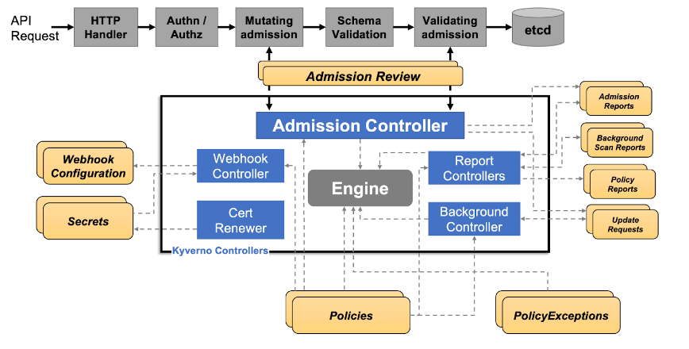

# Kubernetes ValidatingWebhookConfiguration

**Der ursprüngliche Autor dieser Seite ist** [**Guillaume**](https://www.linkedin.com/in/guillaume-chapela-ab4b9a196)

## Definition

ValidatingWebhookConfiguration ist eine Kubernetes-Ressource, die einen Validierungswebhook definiert, der eine serverseitige Komponente ist, die eingehende Kubernetes-API-Anfragen gegen eine Reihe vordefinierter Regeln und Einschränkungen validiert.

## Zweck

Der Zweck einer ValidatingWebhookConfiguration besteht darin, einen Validierungswebhook zu definieren, der eine Reihe vordefinierter Regeln und Einschränkungen für eingehende Kubernetes-API-Anfragen durchsetzt. Der Webhook validiert die Anfragen gegen die in der Konfiguration definierten Regeln und Einschränkungen und gibt einen Fehler zurück, wenn die Anfrage nicht den Regeln entspricht.

**Beispiel**

Hier ist ein Beispiel für eine ValidatingWebhookConfiguration:
```yaml
apiVersion: admissionregistration.k8s.io/v1
kind: ValidatingWebhookConfiguration
metadata:
name: example-validation-webhook
namespace: default
webhook:
name: example-validation-webhook
clientConfig:
url: https://example.com/webhook
serviceAccountName: example-service-account
rules:
- apiGroups:
- ""
apiVersions:
- "*"
operations:
- CREATE
- UPDATE
resources:
- pods
```
Der Hauptunterschied zwischen einer ValidatingWebhookConfiguration und Richtlinien :&#x20;


<figure><figcaption><p>Kyverno.png</p></figcaption></figure>

* **ValidatingWebhookConfiguration (VWC)** : Eine Kubernetes-Ressource, die einen Validierungswebhook definiert, der eine serverseitige Komponente ist, die eingehende Kubernetes-API-Anfragen anhand einer Reihe vordefinierter Regeln und Einschränkungen validiert.
* **Kyverno ClusterPolicy**: Eine Richtliniendefinition, die eine Reihe von Regeln und Einschränkungen für die Validierung und Durchsetzung von Kubernetes-Ressourcen wie Pods, Deployments und Services spezifiziert.

## Enumeration
```
$ kubectl get ValidatingWebhookConfiguration
```
### Missbrauch von Kyverno und Gatekeeper VWC

Wie wir sehen können, haben alle installierten Operatoren mindestens eine ValidatingWebHookConfiguration (VWC).

**Kyverno** und **Gatekeeper** sind beide Kubernetes-Policy-Engines, die einen Rahmen für die Definition und Durchsetzung von Richtlinien in einem Cluster bieten.

Ausnahmen beziehen sich auf spezifische Regeln oder Bedingungen, die es ermöglichen, eine Richtlinie unter bestimmten Umständen zu umgehen oder zu ändern, aber das ist nicht der einzige Weg!

Für **kyverno**, da es eine validierende Richtlinie gibt, wird das Webhook `kyverno-resource-validating-webhook-cfg` befüllt.

Für Gatekeeper gibt es die `gatekeeper-validating-webhook-configuration` YAML-Datei.

Beide kommen mit Standardwerten, aber die Administratorenteams könnten diese 2 Dateien aktualisiert haben.

### Anwendungsfall
```bash
$ kubectl get validatingwebhookconfiguration kyverno-resource-validating-webhook-cfg -o yaml
```
Jetzt identifizieren Sie die folgende Ausgabe:
```yaml
namespaceSelector:
matchExpressions:
- key: kubernetes.io/metadata.name
operator: NotIn
values:
- default
- TEST
- YOYO
- kube-system
- MYAPP
```
Hier bezieht sich das Label `kubernetes.io/metadata.name` auf den Namespace-Namen. Namespaces mit Namen in der `values`-Liste werden von der Richtlinie ausgeschlossen:

Überprüfen Sie die Existenz von Namespaces. Manchmal könnten aufgrund von Automatisierung oder Fehlkonfiguration einige Namespaces nicht erstellt worden sein. Wenn Sie die Berechtigung haben, einen Namespace zu erstellen, könnten Sie einen Namespace mit einem Namen in der `values`-Liste erstellen, und die Richtlinien würden auf Ihren neuen Namespace nicht angewendet.

Das Ziel dieses Angriffs ist es, **Fehlkonfigurationen** innerhalb von VWC auszunutzen, um die Einschränkungen der Operatoren zu umgehen und dann Ihre Berechtigungen mit anderen Techniken zu erhöhen.


[abusing-roles-clusterroles-in-kubernetes](abusing-roles-clusterroles-in-kubernetes/)


## Referenzen

* [https://github.com/open-policy-agent/gatekeeper](https://github.com/open-policy-agent/gatekeeper)
* [https://kyverno.io/](https://kyverno.io/)
* [https://kubernetes.io/docs/reference/access-authn-authz/extensible-admission-controllers/](https://kubernetes.io/docs/reference/access-authn-authz/extensible-admission-controllers/)
